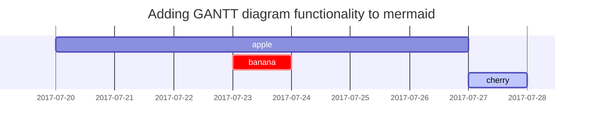

## First

this is a test file

## Second

Test of image:

{: w="70", h="40"}
_Image Name_

### ToDo list

- [ ] Job
  + [x] Step 1
  + [x] Step 2
  + [ ] Step 3

## Prompts

> An example showing the `tip` type prompt.
> {: .prompt-tip }

> An example showing the `info` type prompt.
> {: .prompt-info }

> An example showing the `warning` type prompt.
> {: .prompt-warning }

> An example showing the `danger` type prompt.
> {: .prompt-danger }

## Mermaid SVG

## Dark/Light mode & Shadow

The image below will toggle dark/light mode based on theme preference, notice it has shadows.

{: .light .w-75 .shadow .rounded-10 w='1212' h='668' }
{: .dark .w-75 .shadow .rounded-10 w='1212' h='668' }

## Video



